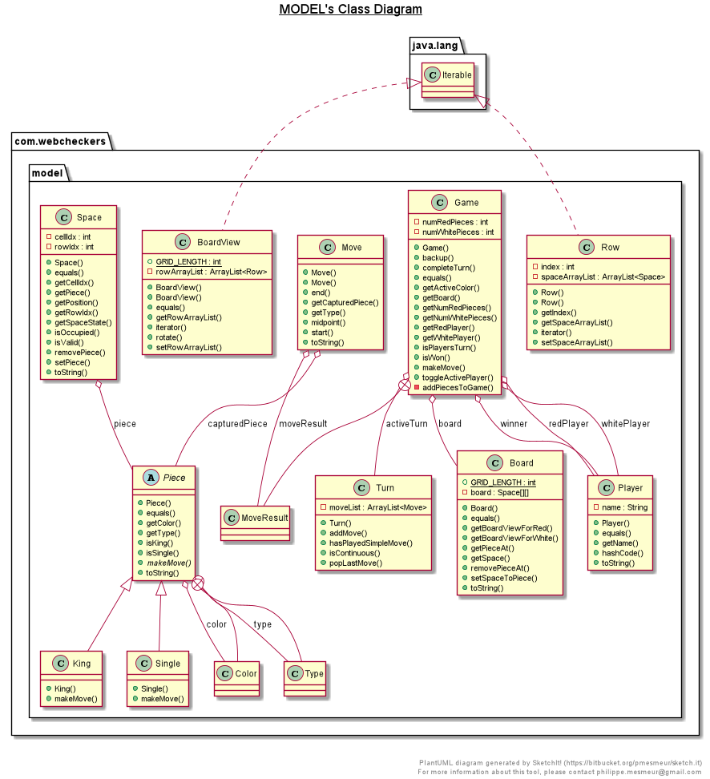

# PROJECT Design Documentation

## Team Information
* Team name: D_Team
* Team members
  * Jack Sipley
  * Aaron Schulte
  * Tyler Talarico

## Executive Summary

This web application is designed with the purpose of allowing users to play online checkers against other users. Users who connect are required to sign in, which simply requires the user to 
provide a valid username. Once signed in users are presented with a list of other users currently signed in, clicking another user's name will start a game if they are available. Users are 
presetned with a drag and drop checkers board until they have completed the game and returned to the home page. 

### Purpose

To allow users to play a game of drag and drop checkers against other users across the interwebs.

### Glossary and Acronyms
> _Provide a table of terms and acronyms._

| Term | Definition |
|------|------------|
| VO | Value Object |
| Position| A coordinate representation of the spaces on a checker board (row,column)|
| MoveResult | A value the represents what type of move was made |
| Type | Type of piece that the checker represents |

## Requirements

This section describes the features of the application.

> _In this section you do not need to be exhaustive and list every
> story.  Focus on top-level features from the Vision document and
> maybe Epics and critical Stories._

### Definition of MVP
> _Provide a simple description of the Minimum Viable Product._

Two players must be able to sign in and play a game of checkers based upon the American rules. The game ends when either one player wins or one of the player resigns.

### MVP Features
> Below is a  list of top-level Epics and/or Stories of the MVP._

###### Start A Game
As a Player I want to start a game so that I can play checkers with an opponent.
###### Player Sign-In
As a Player I want to sign-in so that I can play a game of checkers.
###### Player Sign-Out
As a Player I want to sign-out so that I can stop playing.
###### King Me
As a Player I want my pieces to be kinged when they reach the end of the board so that my checker can move/jump forward or backwards.
##### Epic: Movement
As a Player I want to move my pieces so that I can play a game of checkers.
###### Simple Move
As a Player I want to move my pieces to vacant locations so that I can play checkers.
###### Jump Move
As a Player I want to jump my opponent’s pieces to capture them so that I can win.
###### Multiple Jump
As a Player I want to continue jumping my opponent’s pieces if possible so that I can win.
###### Jump Move
As a Player I want to jump my opponent’s pieces to capture them so that I can win.
##### Epic: End Game
As a Player I want to end the game so that I can do other actions.
###### Victory
As a Player I want the game to end when I have won or lost so that I decide what to do after.
###### Resignation
As a Player I want to be able to resign at any point during a game so that I can quit or start another.

### Roadmap of Enhancements
> _Below is a list of top-level features in the order you plan to consider them._

#### Epic: Multi-Game Interface
The player should be equipped with an interface which can display multiple games.
###### Add Game
As the player I want another game displayed when asked to play another game.
###### Rematch
As a player I want to offer a rematch after a game so that I can play again.
#### Epic: AI-Logic
The AI must be able to complete a game of checkers comparable to a human.
###### Where To Move
As a player I want the AI to have an idea of where it is in relation to the board and pieces.
###### Fight Or Flight
As an AI I want to know when to capture opponents’ pieces or move someplace else.

## Application Domain

This section describes the application domain.

> _Provide a high-level overview of the domain for this application. You
> can discuss the more important domain entities and their relationship
> to each other._

Two players play a game, each game consists of one 8x8 board consisting 64 spaces. Pieces are set up on this board according to the American rules for checkers.

## Architecture and Design

This section describes the application architecture.

### Summary

The following Tiers/Layers model shows a high-level view of the webapp's architecture.

As a web application, the user interacts with the system using a
browser.  The client-side of the UI is composed of HTML pages with
some minimal CSS for styling the page.  There is also some JavaScript
that has been provided to the team by the architect.

The server-side tiers include the UI Tier that is composed of UI Controllers and Views.
Controllers are built using the Spark framework and View are built using the FreeMarker framework.  The Application and Model tiers are built using plain-old Java objects (POJOs).

Details of the components within these tiers are supplied below.

### Overview of User Interface

This section describes the web interface flow; this is how the user views and interacts
with the WebCheckers application.

> _Provide a summary of the application's user interface.  Describe, from
> the user's perspective, the flow of the pages in the web application._

When a user connects they will be directed to the home page where there only option will be to click the "sign-in" button. This will take the user to the sign in page where the user is required to enter a valid username. Once a valid username is entered the user is taken back to the home page and presented with a list of online players. Clicking the name of an online player will take the user to the game page where they will play out their game of checkers until completion. Once completed, the user will be directed back to home. 

### UI Tier
> _Provide a summary of the Server-side UI tier of your architecture.
> Describe the types of components in the tier and describe their
> responsibilities.  This should be a narrative description, i.e. it has
> a flow or "story line" that the reader can follow._

> _At appropriate places as part of this narrative provide one or more
> static models (UML class structure or object diagrams) with some
> details such as critical attributes and methods._

> _You must also provide any dynamic models, such as statechart and
> sequence diagrams, as is relevant to a particular aspect of the design
> that you are describing.  For example, in WebCheckers you might create
> a sequence diagram of the `POST /validateMove` HTTP request processing
> or you might show a statechart diagram if the Game component uses a
> state machine to manage the game._

> _If a dynamic model, such as a statechart describes a feature that is
> not mostly in this tier and cuts across multiple tiers, you can
> consider placing the narrative description of that feature in a
> separate section for describing significant features. Place this after
> you describe the design of the three tiers._

### Application Tier
> _Provide a summary of the Application tier of your architecture. This
> section will follow the same instructions that are given for the UI
> Tier above._

### Model Tier
> _The Model Tier encapsulates the base of the Webcheckers project.
> The Game class holds relevant information for any game between two players.
> Players control pieces located in the UI. The pieces themselves determine
> whether a move is possible based on the current board configuration. 
> The Game uses information passed into it from the Piece in order to accordingly
> update the Board object that represents the current game._

### Design Improvements
> _Discuss design improvements that you would make if the project were
> to continue. These improvement should be based on your direct
> analysis of where there are problems in the code base which could be
> addressed with design changes, and describe those suggested design
> improvements. After completion of the Code metrics exercise, you
> will also discuss the resutling metric measurements.  Indicate the
> hot spots the metrics identified in your code base, and your
> suggested design improvements to address those hot spots._

## Testing
> _This section will provide information about the testing performed
> and the results of the testing._

### Acceptance Testing
> _Report on the number of user stories that have passed all their
> acceptance criteria tests, the number that have some acceptance
> criteria tests failing, and the number of user stories that
> have not had any testing yet. Highlight the issues found during
> acceptance testing and if there are any concerns._

### Unit Testing and Code Coverage
> _Unit Tests for Simple Move, Jump Move, and Multi Jump have been fully written
> and passed. They cover various situations such as occupied spaces, jump requirements,
> and restrictions on movement for single pieces._
